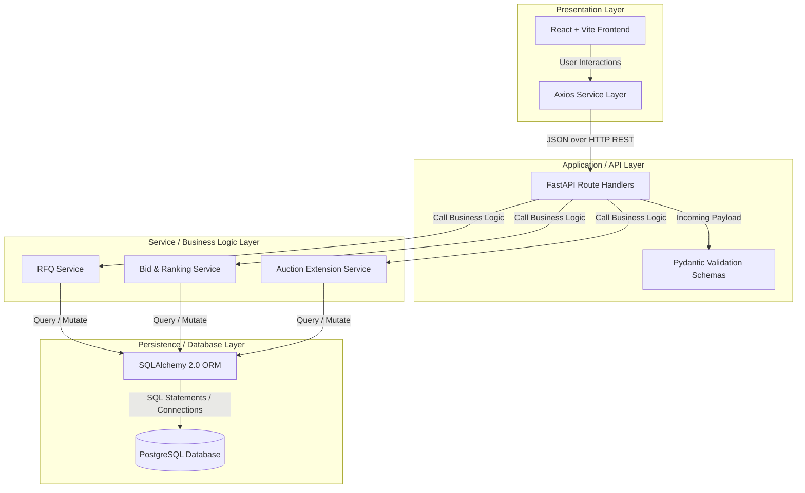
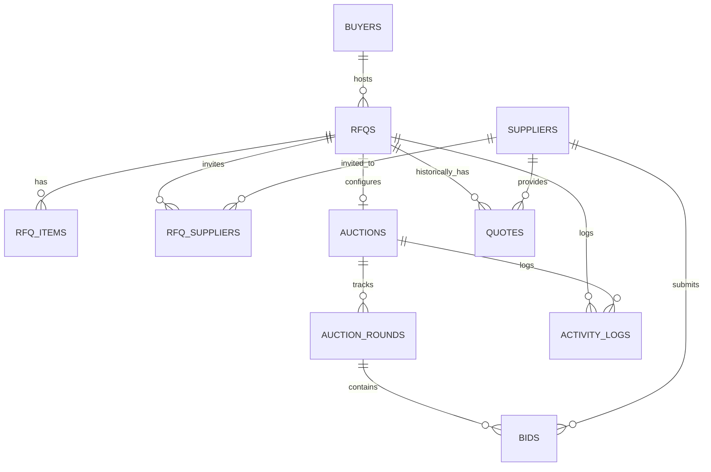

# British Auction in RFQ System

A full-stack procurement and auction management platform that implements **British Auctions within a Request for Quotation (RFQ) workflow**.

---

## 1. Project Overview

### What is an RFQ?
An **RFQ (Request for Quotation)** is a procurement process where a buyer invites multiple suppliers to submit quotes for providing a service or product. Suppliers compete by offering the best prices and terms, and the buyer selects the most suitable quote.

### What is a British Auction in this project?
In this application, a **British Auction** refers to a dynamic reverse-auction competitive bidding process where:
- **Open Bidding:** Suppliers submit bids openly, enabling visibility into competitors' pricing.
- **Continuous Price Decrease:** Suppliers can continuously lower their bid prices to beat competitors.
- **Automatic Extensions:** Bidding activity close to the scheduled close time automatically extends the auction duration.
- **Forced Close Boundary:** A hard forced close time sets an absolute limit past which no further extensions or bids can occur.

This prevents sniping (last-second bid manipulation) and encourages fair competition.

---

## 2. Problem Statement

Standard procurement workflows suffer from:
1. **Sniping / Manipulation:** Suppliers wait until the last possible second to submit bids, leaving competitors no time to respond.
2. **Pricing Opacity:** Suppliers lack visibility on competing bids, preventing them from offering their best margins.
3. **Rigid Timelines:** Fixed bid closing times restrict potential price drops.

This application solves these issues by offering **configurable trigger windows, rank-change or bid-received extension triggers, and automated scheduling rules** that guarantee fair bidding timelines.

---

## 3. Business Objectives

- **Enable Fair Competition:** Transparent leaderboards ensure all suppliers can bid again to win.
- **Prevent Sniping:** Ensure that last-minute bidding activity extends the timeline, giving other bidders a fair chance to react.
- **Maximize Cost Savings:** Continuous competition drives final purchase values down for buyers.
- **Assure Timing Boundaries:** Forced bid closing protects the buyer's procurement schedule from infinite delays.

---

## 4. Core Features

### RFQ Creation
- **Buyer Selection/Creation:** Select an existing buyer profile or create one on the fly.
- **General Fields:** RFQ Title, Reference ID, Description, Category, Currency (default `USD`), and Baseline Price.
- **Line Items:** Add multiple line items, each with an Item Name, Quantity, and Unit of Measure.

### Auction Schedule
- **Bid Start Date & Time:** Time when suppliers can start submitting bids.
- **Bid Close Date & Time:** Scheduled end time of the auction.
- **Forced Bid Close Date & Time:** The hard boundary after which no bids are accepted. Must be strictly later than the Bid Close Date & Time.
- **Pickup / Service Date:** Optional field to specify delivery timelines.

### British Auction Configuration
The extension rules are controlled by three settings:
- **Trigger Window (X Minutes):** The duration before the current close time where activity is monitored.
- **Extension Duration (Y Minutes):** The amount of time added when an extension triggers.
- **Extension Triggers:**
  1. `BID_RECEIVED`: Any bid submitted during the trigger window extends the auction.
  2. `ANY_RANK_CHANGE`: Any bid that changes the relative rank of any supplier extends the auction.
  3. `L1_RANK_CHANGE`: An extension is triggered only when a bid changes the L1 (first place) supplier.

### Supplier Management
- Suppliers are created once and can be reused across multiple independent RFQs.
- Unique email constraint enforced per supplier.

### Bid & Quote Submission
- **Bids:** Select RFQ and supplier, validate that amount is below the baseline price, and check against active auction timelines.
- **Quote Breakdown Details:** Submit comprehensive logistics breakdowns:
  - Carrier Name (`carrier_name`)
  - Freight Charges (`freight_charges`)
  - Origin Charges (`origin_charges`)
  - Destination Charges (`destination_charges`)
  - Transit Time (`transit_time`)
  - Validity of Quote (`validity_of_quote`)

### Bid Ranking
- Calculate deterministic ranks. Ranks are ordered by bid amount ascending (lowest price = Rank 1, L1).
- **Tie-Breaking:** Tie-breaking is resolved deterministically by submission timestamp (earlier bid wins) and UUID.

### Auction Extension & Forced Close
- Extensions recalculate and shift the current `end_time` of the `Auction` entity.
- If the new close time exceeds the `forced_bid_close_time`, the close time is capped exactly at the `forced_bid_close_time`.

### Auction Listing & Details
- **Listing:** Show all auctions with RFQ details, current lowest bid, countdown timers, and live statuses (Scheduled, Active, Closed).
- **Details:** View all supplier bids sorted by price/rank, complete quote breakdown fields, auction configurations, and a chronological activity log.

### Activity Tracking
- Tracks chronological events with actor, event types, messages, and structured JSON metadata:
  - `RFQ_CREATED` / `RFQ_PUBLISHED`
  - `BID_SUBMITTED` / `BID_REJECTED`
  - `AUCTION_EXTENDED` (includes the exact trigger reason and minutes added)
  - `AUCTION_CLOSED`

### Core Bidding Workflow
The lifecycle of procurement through a reverse auction involves the following key stages:
1. **Profile Setup:** A Buyer profile is selected or created. Supplier profiles are registered and can be reused across multiple independent RFQs.
2. **RFQ & Auction Setup:** A Buyer creates a new RFQ with a baseline (ceiling) price, currency, and line items. The associated British Auction is automatically initialized with:
   - `start_time` and `end_time`.
   - `forced_bid_close_time` (strictly greater than `end_time`).
   - Extension triggers (window, duration, trigger mode).
3. **Bidding Participation:** Invited suppliers access the active auction workspace to submit bids.
4. **Validation Engine:** The backend validates each incoming bid:
   - Must be submitted between the auction `start_time` and the current `end_time`.
   - Cannot exceed the `forced_bid_close_time`.
   - Bid `amount` must be lower than the RFQ's `baseline_price`.
   - Supplier must be associated/invited.
5. **Real-time Ranking Calculation:** The system recalculates supplier rankings based on the lowest bid amount. In case of matching bid amounts, tie-breaking resolves in favor of the earlier submission timestamp.
6. **Timeline Extension Checks:** If a valid bid is placed within the trigger window before `end_time`, the backend checks the trigger configuration:
   - `BID_RECEIVED`: Alway triggers an extension.
   - `ANY_RANK_CHANGE`: Triggers if the bid alters the relative rankings of any suppliers.
   - `L1_RANK_CHANGE`: Triggers only if the bid establishes a new lowest price (Rank 1).
   - If an extension triggers, the `end_time` is incremented by the extension duration. If this new close time exceeds the `forced_bid_close_time`, it is capped exactly at the forced close time limit.
7. **Forced Close & Final State:** Once the time passes the close limit or the absolute forced close boundary, all bid submissions are rejected, and the auction status shifts to `Closed`.
8. **Activity Trail:** Every creation, bid submission, rejection, and timeline extension is logged with descriptive details and structured JSON metadata.

---

## 5. High-Level Design (HLD) & Architecture

This application employs a modern, decoupled layered architecture separating the **Presentation Layer (Frontend)**, **Application & Validation Layer (FastAPI Backend)**, and the **Data Access & Storage Layer (SQLAlchemy ORM + PostgreSQL)**.

### Architectural Blueprint


### Layer Breakdown & Design Pattern
1. **Presentation Layer (React + Vite):**
   - Built on React 18/19 and routing with React Router.
   - Leverages a custom, highly responsive slate/glow design system defined completely in vanilla CSS ([index.css](frontend/src/index.css)).
   - Uses Axios to communicate with the REST API backend under [services/api.js](frontend/src/services/api.js).
2. **Application / API Routing Layer (FastAPI):**
   - Routes located under `backend/app/api/routes` map URLs to Python function handlers.
   - Pydantic models in `backend/app/schemas` declare expected data shapes, perform automatic datatyping, and output custom serialization structures.
3. **Service & Business Logic Layer (Python Services):**
   - Handles the complex logic of RFQ calculations, reverse auction ranking calculations, and timing boundaries.
   - `bid_service.py`: Computes deterministic L1/L2/L3 rankings with tie-breaking rules.
   - `extension_service.py`: Checks incoming bids against extension trigger windows (e.g. bid inside trigger window, rank changes, or L1 changes) and extends timelines dynamically.
4. **Persistence & Storage Layer (SQLAlchemy & PostgreSQL):**
   - Uses SQLAlchemy 2.0 declarative mapping for strict object-relational mapping.
   - Connection pooling and transactions are scoped per request using FastAPI's dependency injection (`get_db`).

---

### Entity Relationship Diagram (ERD)


---

## 6. Complete Database Schema Design

The application utilizes PostgreSQL to guarantee transaction atomicity and relational constraints. Here is the complete relational schema configuration:

### 1. `buyers` (Table)
Stores buyer account profiles.

| Column Name | Data Type | Nullable | Constraints / Default | Description |
| :--- | :--- | :--- | :--- | :--- |
| `id` | `UUID` | No | `PRIMARY KEY`, Default: `uuid_generate_v4()` | Unique identifier for the buyer profile. |
| `name` | `VARCHAR(255)` | No | - | Contact or representative name. |
| `email` | `VARCHAR(255)` | No | `UNIQUE`, `INDEXED` | Unique email address. |
| `company_name` | `VARCHAR(255)` | Yes | - | Organization name. |
| `created_at` | `TIMESTAMPTZ` | No | Default: `now()` | Timestamp when record was created. |
| `updated_at` | `TIMESTAMPTZ` | No | Default: `now()` | Timestamp when record was last updated. |

### 2. `suppliers` (Table)
Stores supplier profiles participating in the platform.

| Column Name | Data Type | Nullable | Constraints / Default | Description |
| :--- | :--- | :--- | :--- | :--- |
| `id` | `UUID` | No | `PRIMARY KEY`, Default: `uuid_generate_v4()` | Unique identifier for the supplier profile. |
| `name` | `VARCHAR(255)` | No | - | Contact or representative name. |
| `email` | `VARCHAR(255)` | No | `UNIQUE`, `INDEXED` | Unique email address. |
| `company_name` | `VARCHAR(255)` | Yes | - | Supplier company name. |
| `created_at` | `TIMESTAMPTZ` | No | Default: `now()` | Timestamp when record was created. |
| `updated_at` | `TIMESTAMPTZ` | No | Default: `now()` | Timestamp when record was last updated. |

### 3. `rfqs` (Table)
Stores Request for Quotation (RFQ) header details.

| Column Name | Data Type | Nullable | Constraints / Default | Description |
| :--- | :--- | :--- | :--- | :--- |
| `id` | `UUID` | No | `PRIMARY KEY`, Default: `uuid_generate_v4()` | Unique identifier for the RFQ. |
| `buyer_id` | `UUID` | No | `FOREIGN KEY REFERENCES buyers(id) ON DELETE CASCADE`, `INDEXED` | Host buyer profile identifier. |
| `title` | `VARCHAR(255)` | No | - | RFQ title or summary. |
| `description` | `TEXT` | Yes | - | Detailed RFQ specifications. |
| `category` | `VARCHAR(100)` | Yes | - | Category classification. |
| `currency` | `VARCHAR(3)` | No | Default: `'USD'` | 3-letter currency code. |
| `baseline_price` | `NUMERIC(12,2)` | No | `CHECK (baseline_price >= 0)` | Maximum ceiling price for bidding. |
| `status` | `VARCHAR(50)` | No | Default: `'DRAFT'`, `INDEXED` | Current workflow state. |
| `pickup_service_date`| `TIMESTAMPTZ` | Yes | - | Estimated pickup or delivery date. |
| `created_at` | `TIMESTAMPTZ` | No | Default: `now()` | Timestamp when record was created. |
| `updated_at` | `TIMESTAMPTZ` | No | Default: `now()` | Timestamp when record was last updated. |

### 4. `rfq_items` (Table)
Stores individual item line specifications for RFQs.

| Column Name | Data Type | Nullable | Constraints / Default | Description |
| :--- | :--- | :--- | :--- | :--- |
| `id` | `UUID` | No | `PRIMARY KEY`, Default: `uuid_generate_v4()` | Unique identifier for the line item. |
| `rfq_id` | `UUID` | No | `FOREIGN KEY REFERENCES rfqs(id) ON DELETE CASCADE`, `INDEXED` | Associated RFQ header. |
| `name` | `VARCHAR(255)` | No | - | Product or service name. |
| `description` | `TEXT` | Yes | - | Product line specifications. |
| `quantity` | `NUMERIC(12,2)` | No | `CHECK (quantity > 0)` | Quantity of item requested. |
| `unit` | `VARCHAR(50)` | No | Default: `'units'` | Unit of measure. |
| `created_at` | `TIMESTAMPTZ` | No | Default: `now()` | Timestamp when record was created. |
| `updated_at` | `TIMESTAMPTZ` | No | Default: `now()` | Timestamp when record was last updated. |

### 5. `rfq_suppliers` (Table)
Join table tracking supplier invitations to submit bids on RFQs.

| Column Name | Data Type | Nullable | Constraints / Default | Description |
| :--- | :--- | :--- | :--- | :--- |
| `id` | `UUID` | No | `PRIMARY KEY`, Default: `uuid_generate_v4()` | Unique identifier for invitation record. |
| `rfq_id` | `UUID` | No | `FOREIGN KEY REFERENCES rfqs(id) ON DELETE CASCADE`, `INDEXED` | Associated RFQ. |
| `supplier_id` | `UUID` | No | `FOREIGN KEY REFERENCES suppliers(id) ON DELETE CASCADE`, `INDEXED` | Invited supplier. |
| `invited_at` | `TIMESTAMPTZ` | No | Default: `now()` | Date and time of invitation. |
| `status` | `VARCHAR(50)` | No | Default: `'INVITED'` | Response status (`INVITED`, `ACCEPTED`, `DECLINED`). |

- **Table Constraints:** `UNIQUE (rfq_id, supplier_id)`

### 6. `auctions` (Table)
Stores timing configuration and countdown metrics for the British Auction rounds.

| Column Name | Data Type | Nullable | Constraints / Default | Description |
| :--- | :--- | :--- | :--- | :--- |
| `id` | `UUID` | No | `PRIMARY KEY`, Default: `uuid_generate_v4()` | Unique identifier for the auction. |
| `rfq_id` | `UUID` | No | `FOREIGN KEY REFERENCES rfqs(id) ON DELETE CASCADE`, `UNIQUE`, `INDEXED` | Associated RFQ header. |
| `start_time` | `TIMESTAMPTZ` | Yes | `INDEXED` | Auction start date and time. |
| `end_time` | `TIMESTAMPTZ` | Yes | `INDEXED` | Current auction close date and time. |
| `forced_bid_close_time`| `TIMESTAMPTZ` | Yes | - | Absolute maximum close date and time boundary. |
| `trigger_window_minutes`| `INTEGER` | No | Default: `10` | Time window monitoring activity near close. |
| `extension_duration_minutes`| `INTEGER` | No | Default: `5` | Minutes to extend if activity triggers it. |
| `extension_trigger` | `VARCHAR(50)` | No | Default: `'BID_RECEIVED'` | Trigger logic rule. |
| `current_round` | `INTEGER` | No | Default: `1` | Count tracking active/completed rounds. |
| `status` | `VARCHAR(50)` | No | Default: `'SCHEDULED'`, `INDEXED` | Timed status state. |
| `created_at` | `TIMESTAMPTZ` | No | Default: `now()` | Timestamp when record was created. |
| `updated_at` | `TIMESTAMPTZ` | No | Default: `now()` | Timestamp when record was last updated. |

### 7. `auction_rounds` (Table)
Stores historical and active round timestamps to distinguish extension phases.

| Column Name | Data Type | Nullable | Constraints / Default | Description |
| :--- | :--- | :--- | :--- | :--- |
| `id` | `UUID` | No | `PRIMARY KEY`, Default: `uuid_generate_v4()` | Unique round identifier. |
| `auction_id` | `UUID` | No | `FOREIGN KEY REFERENCES auctions(id) ON DELETE CASCADE`, `INDEXED` | Parent auction identifier. |
| `round_number` | `INTEGER` | No | - | Chronological round number. |
| `start_time` | `TIMESTAMPTZ` | Yes | - | Round start date/time. |
| `end_time` | `TIMESTAMPTZ` | Yes | - | Round end date/time. |
| `status` | `VARCHAR(50)` | No | Default: `'PENDING'` | Round status (`PENDING`, `ACTIVE`, `COMPLETED`, `CANCELLED`). |
| `created_at` | `TIMESTAMPTZ` | No | Default: `now()` | Record creation timestamp. |

- **Table Constraints:** `UNIQUE (auction_id, round_number)`

### 8. `bids` (Table)
Stores active dynamic supplier bids, with detailed freight breakdowns.

| Column Name | Data Type | Nullable | Constraints / Default | Description |
| :--- | :--- | :--- | :--- | :--- |
| `id` | `UUID` | No | `PRIMARY KEY`, Default: `uuid_generate_v4()` | Unique identifier for bid record. |
| `auction_id` | `UUID` | No | `FOREIGN KEY REFERENCES auctions(id) ON DELETE CASCADE`, `INDEXED` | Associated auction identifier. |
| `round_id` | `UUID` | No | `FOREIGN KEY REFERENCES auction_rounds(id) ON DELETE CASCADE`, `INDEXED` | Associated round identifier. |
| `supplier_id` | `UUID` | No | `FOREIGN KEY REFERENCES suppliers(id) ON DELETE CASCADE`, `INDEXED` | Bidding supplier identifier. |
| `amount` | `NUMERIC(12,2)` | No | `CHECK (amount >= 0)` | Bidded price. |
| `carrier_name` | `VARCHAR(255)` | Yes | - | Transport carrier breakdown. |
| `freight_charges` | `NUMERIC(12,2)` | Yes | - | Freight charge component. |
| `origin_charges` | `NUMERIC(12,2)` | Yes | - | Origin charge component. |
| `destination_charges` | `NUMERIC(12,2)` | Yes | - | Destination charge component. |
| `transit_time` | `VARCHAR(100)` | Yes | - | Transit time breakdown. |
| `validity_of_quote` | `VARCHAR(100)` | Yes | - | Validity timeframe breakdown. |
| `submitted_at` | `TIMESTAMPTZ` | No | Default: `now()`, `INDEXED` | Submission timestamp. |
| `is_valid` | `BOOLEAN` | No | Default: `True` | Bid validity status flag. |

- **Table Constraints:** `UNIQUE (auction_id, supplier_id)`

### 9. `quotes` (Table)
Stores static/historical supplier quotes placed before the live auction triggers.

| Column Name | Data Type | Nullable | Constraints / Default | Description |
| :--- | :--- | :--- | :--- | :--- |
| `id` | `UUID` | No | `PRIMARY KEY`, Default: `uuid_generate_v4()` | Unique quote identifier. |
| `rfq_id` | `UUID` | No | `FOREIGN KEY REFERENCES rfqs(id) ON DELETE CASCADE`, `INDEXED` | Associated RFQ. |
| `supplier_id` | `UUID` | No | `FOREIGN KEY REFERENCES suppliers(id) ON DELETE CASCADE`, `INDEXED` | Submitting supplier. |
| `amount` | `NUMERIC(12,2)` | No | `CHECK (amount >= 0)` | Offer price. |
| `currency` | `VARCHAR(3)` | No | Default: `'USD'` | 3-letter currency code. |
| `status` | `VARCHAR(50)` | No | Default: `'SUBMITTED'` | Quote state (`DRAFT`, `SUBMITTED`, `WITHDRAWN`). |
| `created_at` | `TIMESTAMPTZ` | No | Default: `now()` | Creation timestamp. |
| `updated_at` | `TIMESTAMPTZ` | No | Default: `now()` | Last updated timestamp. |

### 10. `activity_logs` (Table)
Stores chronologically ordered logging details for all operations.

| Column Name | Data Type | Nullable | Constraints / Default | Description |
| :--- | :--- | :--- | :--- | :--- |
| `id` | `UUID` | No | `PRIMARY KEY`, Default: `uuid_generate_v4()` | Unique log record identifier. |
| `rfq_id` | `UUID` | Yes | `FOREIGN KEY REFERENCES rfqs(id) ON DELETE SET NULL`, `INDEXED` | Associated RFQ. |
| `auction_id` | `UUID` | Yes | `FOREIGN KEY REFERENCES auctions(id) ON DELETE SET NULL`, `INDEXED` | Associated Auction. |
| `actor_type` | `VARCHAR(50)` | No | - | Entity role performing action. |
| `actor_id` | `UUID` | Yes | - | Profile UUID of the actor. |
| `event_type` | `VARCHAR(100)` | No | - | Event action category. |
| `message` | `TEXT` | No | - | Human-readable log details. |
| `metadata_json` | `JSON` | Yes | - | Event-specific key-value info. |
| `created_at` | `TIMESTAMPTZ` | No | Default: `now()`, `INDEXED` | Event logged timestamp. |

---

## 7. API Endpoints Reference

### Health & Diagnostics
- `GET /health` - Returns `{"status": "ok"}`.
- `GET /health/db` - Returns `{"status": "ok", "database": "connected"}`.

### Buyers
- `POST /api/v1/buyers` - Create a new buyer.
- `GET /api/v1/buyers` - List buyers (supports offset/limit pagination and filter by email).
- `GET /api/v1/buyers/{buyer_id}` - Retrieve a buyer profile.

### Suppliers
- `POST /api/v1/suppliers` - Create a new supplier.
- `GET /api/v1/suppliers` - List suppliers (supports pagination and email filter).
- `GET /api/v1/suppliers/{supplier_id}` - Retrieve a supplier profile.

### Requests for Quotation (RFQs)
- `POST /api/v1/rfqs` - Create an RFQ with items and initialize the associated British Auction.
- `GET /api/v1/rfqs` - List all RFQs.
- `GET /api/v1/rfqs/{rfq_id}` - Retrieve detailed RFQ info.
- `GET /api/v1/rfqs/{rfq_id}/ranking` - Calculate and retrieve current ranked supplier list.
- `GET /api/v1/rfqs/{rfq_id}/activity` - Retrieve chronological activity logs.

### Bids
- `POST /api/v1/bids` - Submit a new supplier bid (applies timing, amount, and extension triggers).
- `GET /api/v1/bids/{bid_id}` - Retrieve detailed bid breakdown.
- `GET /api/v1/bids/rfq/{rfq_id}` - List all bids for a specific RFQ.

### Auctions
- `GET /api/v1/auctions` - List all British Auctions with current lowest bid status and countdown timer states.
- `GET /api/v1/auctions/{identifier}` - Get full auction room workspace including bid rankings, configurations, and logs.
- `GET /api/v1/auctions/{identifier}/activity` - Get auction activity logs.

---

## 8. Setup, Execution & Testing Instructions

### Prerequisites
- **Python**: Version 3.10+ (Python 3.13 recommended)
- **Node.js**: Version 18+ (Node 20+ recommended)
- **PostgreSQL**: Version 14+ running locally (default port: `5433` or `5432`)

### 1. PostgreSQL DB Initialization
Create a database named `british_auction`:
```sql
CREATE DATABASE british_auction;
```

### 2. Backend Setup
1. Create a Python virtual environment and activate it:
   ```bash
   python -m venv venv
   # On Windows:
   .\venv\Scripts\activate
   # On macOS/Linux:
   source venv/bin/activate
   ```
2. Install dependencies:
   ```bash
   pip install -r requirements.txt
   ```
3. Configure Environment Variables:
   - Copy the environment variable template:
     ```bash
     cp .env.example .env
     ```
   - **Important:** Open `.env` and replace all placeholder values (such as `<YOUR_PASSWORD>` and `<YOUR_DATABASE_NAME>`) in `DATABASE_URL` with your actual local database credentials.
4. Run migrations using Alembic:
   ```bash
   cd backend
   alembic upgrade head
   ```
5. Run the FastAPI development server:
   ```bash
   uvicorn app.main:app --reload --host 0.0.0.0 --port 8000
   ```
6. Verify backend is running by opening:
   - Swagger Documentation: [http://localhost:8000/docs](http://localhost:8000/docs)
   - Health Endpoint: [http://localhost:8000/health](http://localhost:8000/health)

### 3. Frontend Setup
1. Navigate to the `frontend` folder:
   ```bash
   cd ../frontend
   ```
2. Install node dependencies:
   ```bash
   npm install
   ```
3. Run the development server:
   ```bash
   npm run dev
   ```
4. Access the web app in your browser at [http://localhost:5173](http://localhost:5173).

### 4. Running Tests
- **Backend Tests (Pytest)**:
  ```bash
  cd backend
  pytest
  ```
- **Frontend Tests (Vitest)**:
  ```bash
  cd frontend
  npm run test
  ```

### 5. Manual End-to-End Verification Flow
You can verify the entire reverse auction workflow using the React Frontend UI:
1. **Host Setup:** Navigate to [http://localhost:5173](http://localhost:5173). In the **Dashboard**, click **Create RFQ**.
2. **Buyer Info:** In step 1, input a contact name and unique email address (e.g. `buyer@company.com`) and click **Save & Next**.
3. **RFQ Header:** Input an RFQ Title (e.g. `Logistics Route A`), category, baseline price (e.g. `20000`), currency (`USD`), and pickup date. Click **Next**.
4. **Line Items:** Click **Add Item**. Fill in item name (e.g. `Container Transport`), quantity (e.g. `10`), unit (`units`), and click **Save & Next**.
5. **Timeline configuration:** Set:
   - **Bid Start Time:** Set to a time in the past or immediately.
   - **Bid Close Time:** Set to a time in the next few minutes.
   - **Forced Close Time:** Set to a time further in the future (e.g. 30 minutes from now).
6. **Auction Configuration:** Set the trigger window (e.g., `10` minutes), extension duration (e.g., `5` minutes), and trigger rule (`BID_RECEIVED`). Click **Save & Next**.
7. **Supplier Invitation:** Click **Add Supplier**. Fill in contact details (e.g. `Supplier A`, `supplier_a@logistics.com`). Repeat to add `Supplier B` (`supplier_b@logistics.com`). Under the suppliers table, select both suppliers to invite them. Click **Publish RFQ**.
8. **Bidding & Quotes:** Go to **Submit Bid** from the Navbar. Select the RFQ you just published and choose `Supplier A`. Under bidding amount, enter `18000`. Fill in carrier details, freight charges (`15000`), origin charges (`1500`), destination charges (`1500`), and transit time. Click **Submit Bid**.
9. **Competitive Underbidding:** Change the supplier to `Supplier B`. Try submitting `19000` (which is higher than Supplier A's L1 bid) and verify that it is accepted but places Supplier B in Rank 2.
10. **Underbid L1:** Change the bid amount to `17000` and submit. Now Supplier B becomes L1 (Rank 1).
11. **Auction Extension:** Submit a lower bid from `Supplier A` within the trigger window. Go back to the **Auctions** dashboard and verify that the close time has shifted forward by the extension duration (5 minutes).
12. **Forced Close boundary validation:** Set up a test RFQ with a very close forced close time (e.g. 1 minute after bid close time). Submit a bid within the last minute, and verify that the close time is extended but gets capped exactly at the forced close time.

